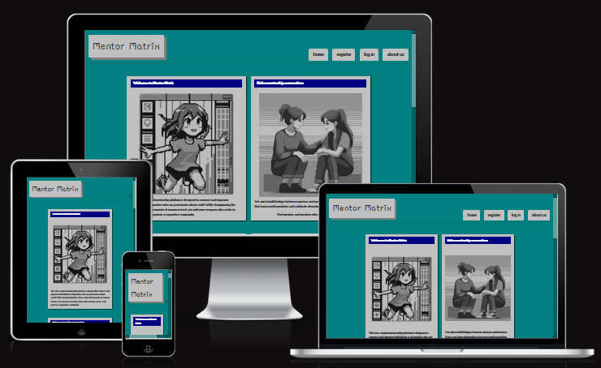
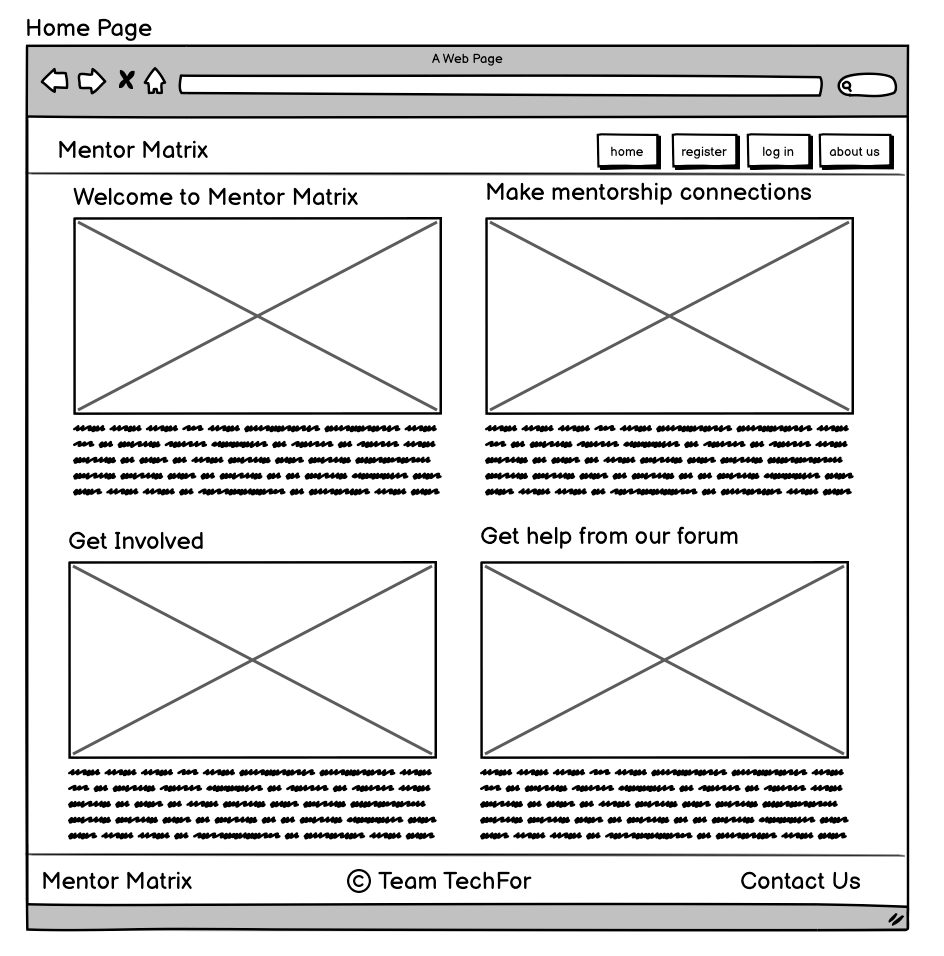
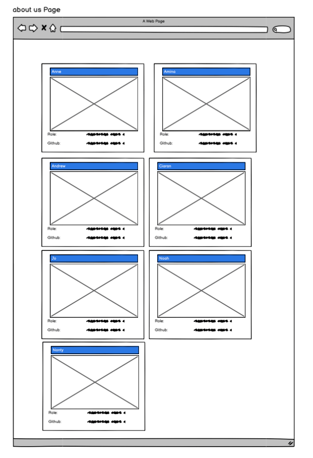
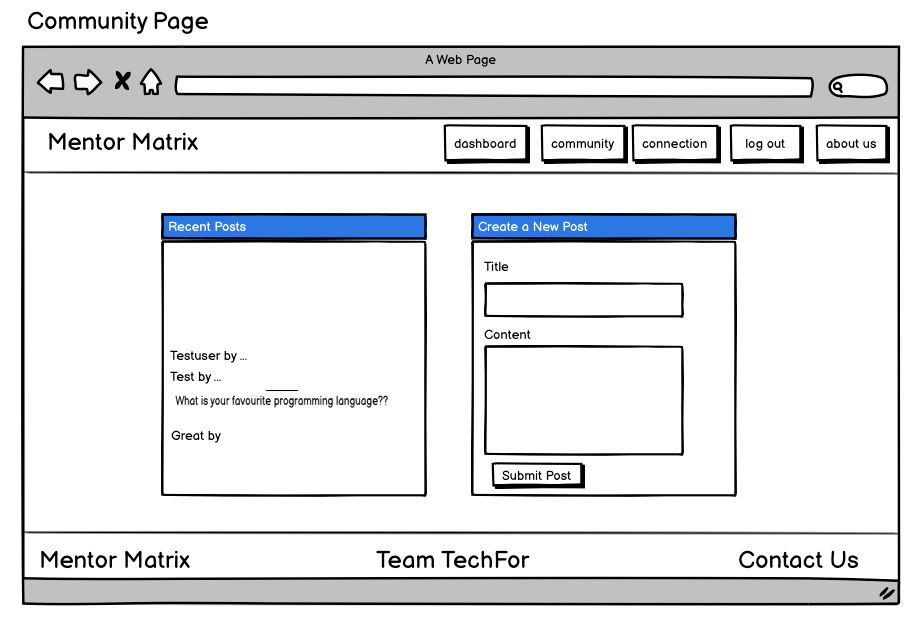
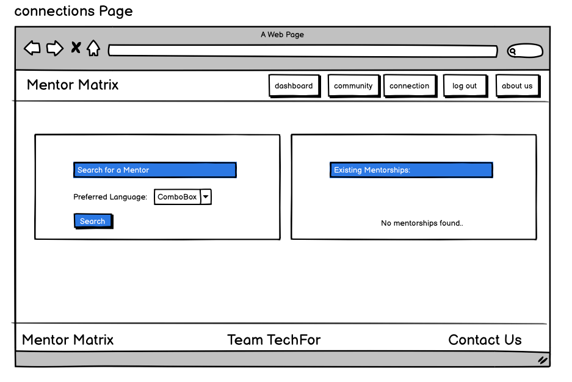
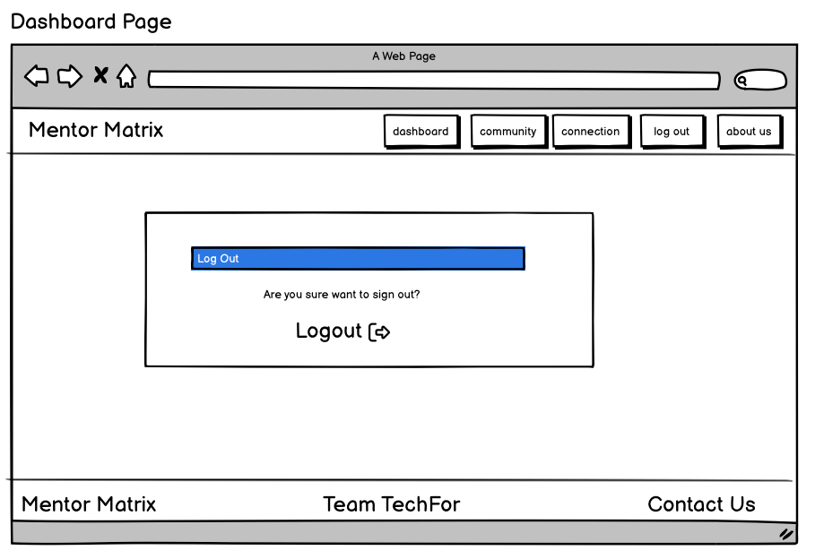

# Mentor Matrix by TechForHer

Mentor Matrix is a mentorship platform designed to empower women in technology by fostering meaningful connections between mentors and mentees. The platform provides a supportive environment where women can share knowledge, gain guidance, and grow their careers in the tech industry.

The Live Website Link can be found here [Mentor Matrix](https://techforher-524ba22af8b9.herokuapp.com/)

### Key Features
Mentor Search: Users can search for mentors based on their preferred programming languages and areas of expertise.
Mentorship Matching: Admins can match mentors with mentees to create structured mentorship relationships.
Contact Mentors: Mentees can directly contact mentors to initiate conversations and seek guidance.
Community Forum: A space for users to share ideas, ask questions, and engage with the community.
User Profiles: Personalized profiles for mentors and mentees to showcase their skills, experience, and interests.
Responsive Design: A user-friendly interface optimized for both desktop and mobile devices.

## Contents
- [Requirements](#requirements)
- [UX](#ux)
    - [Project Goals](#project-goals)
    - [User Demographic](#user-demographic)
    - [User Goals](#user-goals)
- [Development](#development)
    - [Collaboration](#collaboration)
    - [Wireframes](#wireframes)
- [Database](#database)
    - [ERD Model](#erd-model)
- [Features](#features)
    - [User Management](#user-managment)
    - [Community Forum](#community-forum)
    - [Connections & Direct Messaging](#connections--direct-messaging)
    - [Contact & Support](#contact--support)
- [Testing and Validation](#testing-and-validation)
- [Bugs](#bugs)
    - [Solved](#solved)
    - [Unsolved](#unsolved)
- [Technologies Used](#technologies-used)
    - [Libraries](#libraries)
- [Deployment](#deployment)
    - [GitHub](#github)
    - [Heroku](#heroku)
- [Future Updates](#future-updates)
    - [Track Progress & Learn](#track-progress--learn)
    - [Access Resources & Opportunities](#access-resources--opportunities)
    - [Community & Forum Improvements](#community--forum-improvements)
    - [Mentorship Matching](#mentorship-matching)
    - [Security & Authentication](#security--authentication)
    - [Mobile Optimization & PWA](#mobile-optimization--pwa)
    - [Data & Insights for Users](#data--insights-for-users)
    - [Third-Party Integrations](#third-party-integrations)
- [Credits](#credits)
    - [Help, Advice and Inspiration](#help-advice-and-inspiration)
    - [Content](#content)

## Requirements
This project was created during the March 2025 Hackathon at Code Institute. The overall theme was set to: Women in Tech. 
Specific requirements for the project creation were: 
    - No Bootstrap: Use a different CSS framework.
    - Retro Tech Mode: 1980's terminal UI, 1990's Windows95/98, 2000's Web 1.0

## UX
1. Design Philosophy
    - The website follows a retro tech mode theme, inspired by old-school computer interfaces, specifically Windows95
    - The color scheme, typography, and UI elements are designed to evoke a nostalgic yet functional feel.

2. Navigation & Accessibility
    - The layout is intuitive and consistent, ensuring users can easily navigate between pages.
    - The navigation bar provides quick access to the website pages, showing accessible pages depending on if the user is logged in or not.
    - Forms and buttons are clearly visible and large enough for easy interaction.

3. Typography & Readability
    - A redesign of the Windows95 font is used to match the retro aesthetic while maintaining readability.
    - A special retro font is used for specific titles to allow them to stand out from the rest of the content.
    - Sufficient contrast is used to ensure text remains legible.

4. Colour Palette
    - The colour palette was chosen based on the original Windows95 colour palette to recreate a similar look.
    - Specific colours include the iconic teal background, the grey window and the blue title colour.

5. Responsiveness
    - The interface is designed to be usable on different screen sizes while preserving the retro feel.

### Project Goals

Mentor Matrix is a dynamic, retro-inspired mentorship platform designed to connect and empower individuals of all genders who are passionate about technology and innovation. While championing the voices and achievements of women in tech, the platform welcomes everyone who seeks to learn, share, and grow in a supportive community.
We aim to build bridges between mentors and mentees.  Users can form relationships that transcend boundaries and celebrate diversity. 
Mentor Matrix is a space where mentoring meets the magic of inclusivity and technology.

### User Demographic

1. Primary Audience
    - Women in Tech: The platform is designed to support women navigating the tech industry by providing mentorship, community engagement, and career growth opportunities.

2. Inclusive Accessibility
    - While the primary focus is on mentoring women, the platform is open to all genders, fostering an inclusive environment where everyone can connect, learn, and grow.

3. Target Users
    - Aspiring & Early-Career Professionals: Women and other individuals looking to break into tech.
    - Experienced Mentors: Those willing to share knowledge and guide mentees.
    - Career Changers: Individuals transitioning into tech from other fields.
    - Tech Enthusiasts & Community Builders: Anyone looking for peer support and networking opportunities.

### User Goals
1. Find & Connect with Mentors
    - Users, especially women in tech, can find experienced mentors who can guide them in their careers.
    - The platform enables mentor-mentee matching to foster meaningful connections.

2. Engage in a Supportive Community
    - Users can participate in the community forum to seek advice, share experiences, and support each other.
    - The forum allows discussions on career growth, technical skills, job opportunities, and personal experiences.
    - Users can gain insights from experienced professionals through shared posts and discussions.

3. Build & Showcase Professional Profiles
    - Users can create profiles that highlight their skills, career aspirations, and mentoring availability.
    - Mentors can showcase their expertise, helping mentees find relevant guidance.

4. Inclusive & Safe Participation
    - The platform is open to all genders, with a focus on supporting women in tech.

## Development
### Collaboration

Building Mentor Matrix was a truly collaborative effort, bringing together our diverse hackathon team with a shared goal: creating an inclusive mentorship platform for women in tech (and beyond).

Teamwork & Roles
Each team member contributed their expertise across different areas, ensuring smooth development:

    - Backend Developers (Anne, Jo, Noah, Amina, Ciaran and Nonty): Designed and implemented the Django-based system, database models, and authentication.
    - Frontend Developers (Andrew, Anne, Amina, Jo, Ciaran and Noah): Crafted the retro tech mode UI, ensuring accessibility and responsiveness.
    - UI/UX Designers (Jo, Amina, Noah and Anne): Focused on making the platform intuitive and easy to navigate.
    - DevOps & Deployment Team (Anne): Managed Heroku deployments, performance optimization, and security.
    - Content & Documentation (Nonty, Anne, Jo and Noah ): Wrote platform content and README documentation.
    - Scrum Lead (Anne): General project management, check ins and team meeting planning.
    - Scrum Assistant (Nonty): Administrative assistance, documentation.
    - Project Presentation (Amina): Create and narrate a three minute project presentation video.

Agile Workflow & Communication
To stay aligned, we followed an Agile approach, breaking tasks into sprints with clear goals:
Daily stand-ups to discuss progress and blockers.

    - GitHub Projects for task tracking and version control.
    - Slack huddles to debug and collaborate in real time.
    - Slack for quick discussions and async communication.

Overcoming Challenges Together
Like any project, we faced hurdles—but teamwork made problem-solving easier!
Database revisions ensured better data structuring for scalability.

    - Development issues like conflicts and bugs were resolved through troubleshooting and team brainstorming.
    - Balancing features vs. time in a hackathon setting helped us prioritize core functionalities first.

The Power of Collaboration
Mentor Matrix is more than just a project—it’s a testament to what teamwork, shared vision, and effective collaboration can achieve in a short time. Every contribution helped shape it into a meaningful platform for mentorship in tech! 

### Wireframes
Wireframes were created and updated during the development process to be able to better plan the layout and functionality of the app.

## Database
The connected Postgres Database was set up via the Code Institute Database Client.

### ERD Model

The Mentor Matrix platform follows a structured relational database model to support mentorship, community discussions, and user interactions.
Key Entities & Relationships

1. Users (CustomUser)
    - Extendes Django included User model
    - Stores user authentication details.
    - Users have roles: mentor or mentee.
    - Supports many-to-many relationships with Language (proficiency).

2. Languages
    - Stores programming languages.
    - Connected to users via a join table (CustomUser_Language).

3. Mentorships
    - Tracks mentor-mentee relationships.
    - Includes a status field (pending, accepted, declined).
    - Stores the preferred language for mentorship.

4. Forum & Replies
    - ForumPost stores user-created posts.
    - Reply tracks responses to forum posts.
    - Can support anonymous posting and admin approval.

5. Messages
    - Enables private messaging between users.
    - Each message links a sender and receiver.

6. Profiles
    - Extends user data with profile pictures and bios.
    - One-to-one relationship with CustomUser.

7. Contact Requests
    - Can stores external inquiries via a contact form.

## Features

### User Management
- Account Access: Users can create an account with a username and password
- Email Optional: Users can choose to add an email at account creation or later.
- Role-based Profiles: Users can register as either a mentor or mentee.
- Profile Customization: Users can upload profile pictures and add a bio.
- Preferred Languages: Users can specify their programming languages of expertise.
- Dashboard: Users can access their most relevant data in one place.

### Community Forum
- Create & Manage Posts: Users can create posts and view all posts in the forum.
- Replies & Conversations: Users can reply to posts to engage in discussion.

### Connections & Direct Messaging
- Mentor Search: Users can search for mentors that have the same preferred language skills.
- One-on-One Chat: Users can send private messages to mentors or mentees.
- Message History: Conversations are stored for future reference and are shown in a user's dashboard.

### Contact & Support
- Contact Admins: All page visitors can contact the admins via a contact form.
- Email response: All contact forms are send to an admin's email account.
- Admin Assistance: Emails can be viewed and directly replied to, allowing fast and easy assistance.

### About Team
- Admin Information: All page visitors can see who the admin and page creator team is.
- Github: Links to each admin's github page are included.
- Admin Images: Retro themed avatars of each admin were custom created to allow more connection between users and admins.

## Testing and Validation
The program has been tested and its code validated, the results can be viewed here 

## Bugs
### Solved
### Unsolved

## Technologies Used

Main: HTML, CSS, JavaScript, Python
Frameworks: Django, Tailwind

IDE: VSCode

Websites:
- GitHub
- Code Institue Database Client
- Heroku

### Libraries

## Deployment

### GitHub

- __On GitHub, the project was set up via the following steps:__

- Log in to GitHub and create repository
- Copy the provided code to set up project in VSCode
- Optional: fork or clone the repository by creating a new branch
- Use for version control during project creation by commiting and pushing code regularly
    - Remember to set `DEBUG` to `False` 
- Connect to Heroku to allow access to code

- __Local Development__

1. How to Fork
- To fork the repository:
- Log in (or sign up) to Github.
- Find the repository you want to fork by either searching for it using the search bar or by directly navigating to its URL.
- Once you're on the repository's main page, locate the "Fork" button in the upper-right corner of the page, usually next to the "Star" button.
- Click on the "Fork" button.

2. How to Clone
- To clone the repository:
- Click on the "Code" button in your forked repository.
- Copy the repository URL (HTTPS, SSH, or GitHub CLI).
- Open a terminal (or command prompt) on your computer.
- Run the following command: git clone <https://github.com/anchvo/techforher>

### Heroku

- __The website was deployed to Heroku via the following steps:__

- In code workspace, add necessary requirements to requirements.txt and Heroku to allowed Hosts
- Log in to Heroku and create new App
- In App settings, set the necessary _Config Vars_:
    - Key `COLLECTSTATIC` and value `TRUE`
- In Deployment tab, connect to GitHub
- Search for project on GitHub
- Deploy project
- In code workspace, set up necessary files to allow database connection
    - Procfile
    - .python-version 
- In App settings, set the necessary _Config Vars_:
    - Key `SECRET_KEY` and value `SECRETVALUE`
    - Key `DATABASE_URL` and value `DATABASEVALUE`
    & remove 
    - Key `COLLECTSTATIC` and value `TRUE`
- Redeploy to set up with database connection
- Redeploy constantly during project development

## Future Updates
As we continue to develop Mentor Matrix, we have several planned enhancements to improve user experience, expand functionality, and increase engagement.
Our goal is to make Mentor Matrix the go-to platform for mentorship in tech—inclusive, supportive, and packed with value. These future updates will help us scale, refine, and enhance the user experience. 

### Track Progress & Learn
    - Users can document their career growth, mentorship experiences, and learning milestones.
    - Progress tracking tools.
    - Structured mentorship plans.

### Access Resources & Opportunities
    - The platform may provide links to learning materials, job postings, and networking events.

### Community & Forum Improvements
    - Anonymous Posting: Users have the option to post without revealing their identity.
    - Admin Approval: Posts and replies require admin approval for moderation.
    - Threaded Replies & Upvoting: Enhance discussions by adding threaded comments and upvote/downvote functionality to highlight useful responses.
    - Post Categories & Tags: Improve content discoverability by allowing posts to be categorized by topic (e.g., Frontend, Backend, Career Advice).
    - Anonymous Posting Enhancements: Expand anonymous posting options with additional privacy settings.

### Mentorship Matching
Enable the database model setup to allow mentor matchmaking
    - Mentorship Requests: Mentees can send mentorship requests to mentors.
    - Request Status: Mentors can accept, decline, or keep requests pending.
    - Language Preference: Matches are based on programming language proficiency.
    - Admin Mentorship Matching: Admins can match mentors to mentees.

Enhanced Matchmaking process
    - Automated Mentor Matching: Improve the mentor-mentee pairing process with an algorithm that considers skills, experience, and learning goals.
    - Session Scheduling: Implement a calendar integration so mentees can book mentorship sessions directly through the platform.
    - Mentorship Progress Tracking: Allow users to set and track mentorship milestones to measure growth over time.

### Security & Authentication
    - Two-Factor Authentication (2FA): Strengthen account security by integrating 2FA for all users.
    - Advanced Moderation Tools: Provide moderators with more control over content, including flagging, reporting, and AI-powered content filtering.

### Mobile Optimization & PWA
    - Progressive Web App (PWA) Support: Enhance the mobile experience by making the platform accessible offline and installable on mobile devices.
    - Push Notifications: Alert users about new messages, forum replies, and mentorship updates.

### Data & Insights for Users
    - Mentorship Impact Analytics: Give mentors and mentees insights into their progress, such as the number of sessions completed and skills improved.
    - Forum Engagement Stats: Show users their most popular posts, interactions, and contributions to the community.

### Third-Party Integrations
    - LinkedIn Profile Sync: Allow users to link their profiles for easier verification and networking.
    - GitHub & Portfolio Showcases: Let users share their projects to gain visibility among mentors and peers.

## Credits
### Help, Advice and Inspiration
- Our Hackathon Facilitator Vasi: Checking in and assistance with GitHub / Git problems
### Content
- ERD:  https://dbdiagram.io
- Site Images: Images were generated by Microsoft Copilot and then edited in Firealpaca drawing program to resemble 8bit.
- Image Compression: https://compress-or-die.com was used to convert images to webp format
- Fonts: “Rainy Hearts” and “w95fa” fonts from https://www.dafont.com 
- The CSS for rainyhearts was generated by Wakamai Fondue - https://wakamaifondue.com 
